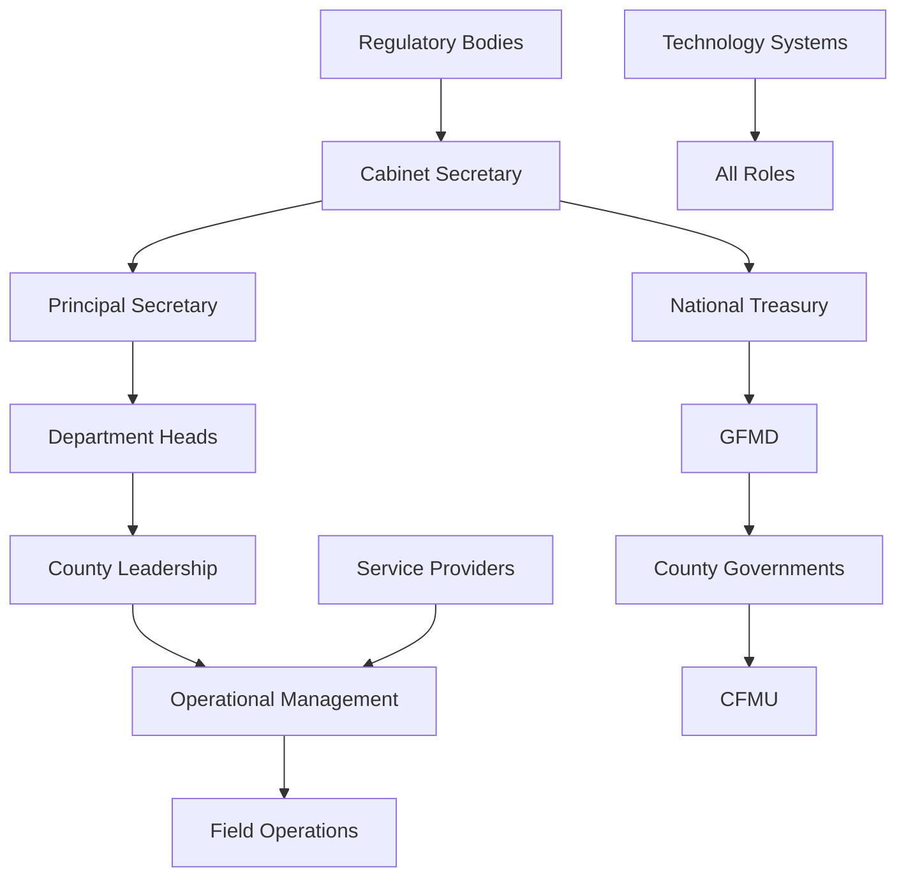

# Government Fleet Management System - Roles Overview

This document provides an overview of all user roles in the Government Fleet Management System (GFMS), organized by the hierarchical structure defined in the Government Transport Policy (2024). Each role has detailed documentation available in the [roles directory](roles/).

## 1. Government Officials

Government officials are individuals with specific positions and responsibilities within the fleet management ecosystem, organized by hierarchical level.

### 1.1 National Leadership

#### [Cabinet Secretary (National Treasury & Economic Planning)](roles/government_officials/national_leadership/Cabinet_Secretary.md)
- **Role Title**: Cabinet Secretary
- **Description**: Highest authority for policy decisions and approvals
- **System Access Level**: Full System Administrator
- **Reports To**: President/Cabinet
- **Overseen By**: Parliament

### 1.2 Senior Administration

#### [Principal Secretary](roles/government_officials/senior_administration/Principal_Secretary.md)
- **Role Title**: Principal Secretary
- **Description**: Authorization for major procurement and policy implementation
- **System Access Level**: Department Administrator
- **Reports To**: Cabinet Secretary

### 1.3 Department Heads

#### Heads of MDACs (Ministries, Departments, Agencies & Counties)
- **Role Title**: Head of MDAC
- **Description**: Chief Executives of State Corporations, Commissioners of Independent Offices
- **System Access Level**: Department Administrator
- **Reports To**: Principal Secretaries

### 1.4 County Leadership

#### Governor
- **Role Title**: Governor
- **Description**: Chief executive of county government
- **System Access Level**: County Administrator
- **Reports To**: County Assembly

#### Deputy Governor
- **Role Title**: Deputy Governor
- **Description**: Assists governor in county administration
- **System Access Level**: County Administrator

### 1.5 Operational Management

#### [Fleet Manager](roles/government_officials/operational_management/Fleet_Manager.md)
- **Role Title**: Fleet Manager
- **Description**: Day-to-day fleet operations and user access management
- **System Access Level**: Operations Manager

#### Accounting Officer
- **Role Title**: Accounting Officer
- **Description**: Financial controls and asset management authority
- **System Access Level**: Financial Administrator

#### Chief Mechanical & Transport Engineer (CMTE)
- **Role Title**: CMTE Official
- **Description**: Technical oversight and maintenance standards
- **System Access Level**: Technical Specialist

### 1.6 Field Operations

#### [Authorized Driver](roles/government_officials/field_operations/Authorized_Driver.md)
- **Role Title**: Authorized Driver
- **Description**: Vehicle operators with tracking and monitoring
- **System Access Level**: Basic User

#### GVCU (Government Vehicle Check Unit) Personnel
- **Role Title**: GVCU Officer
- **Description**: Enforcement and compliance monitoring
- **System Access Level**: Compliance Monitor

## 2. Government Departments

Institutional entities responsible for various aspects of fleet management.

### 2.1 National Level Institutions

#### National Treasury
- **Role Title**: National Treasury
- **Description**: Top-level coordinator for all government fleet operations

#### Government Fleet Management Department (GFMD)
- **Role Title**: GFMD
- **Description**: Operational control over fleet management systems, coordinates with all MDACs

### 2.2 County Level Institutions

#### County Governments
- **Role Title**: County Government
- **Description**: Local implementation of national fleet policies

#### County Fleet Management Units (CFMU)
- **Role Title**: CFMU
- **Description**: Parallel structure to GFMD at county level

### 2.3 External Entities

#### Original Equipment Manufacturers (OEMs)
- **Role Title**: OEM
- **Description**: Vehicle manufacturers and suppliers

#### Insurance Companies
- **Role Title**: Insurance Provider
- **Description**: Providers of vehicle insurance services

## 3. Policy Implementation Bodies

Entities responsible for policy execution and oversight.

## 4. Regulatory Bodies

Entities with oversight and compliance functions.

#### National Transport & Safety Authority (NTSA)
- **Role Title**: NTSA
- **Description**: Vehicle registration and inspection authority

#### Judiciary
- **Role Title**: Judiciary
- **Description**: Legal oversight and dispute resolution

## 5. Service Providers

External entities providing goods and services.

## 6. Technology Systems

Digital platforms and tools for fleet management.

---

## Role Relationship Diagram

This overview provides a high-level view of the roles in the GFMS. For detailed information about each role, including specific use cases, permissions, and integration points, please refer to the individual role documentation in the [roles directory](roles/).